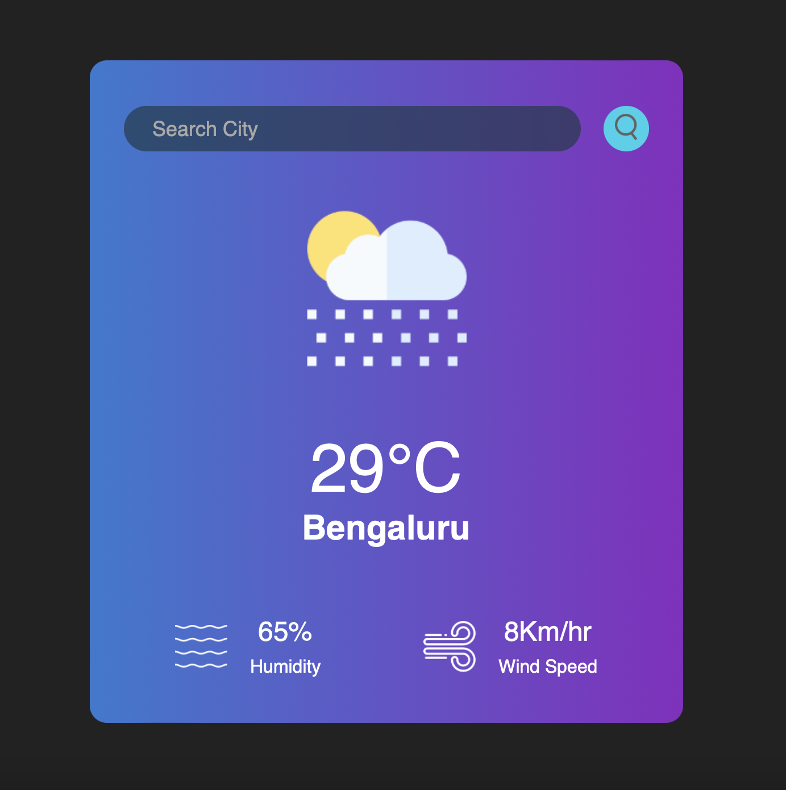

# Weather_App-v1

This Weather App is a simple web application that allows users to retrieve real-time weather information for cities around the world. It provides current temperature, humidity, wind speed, and weather icons for easy visualization.

## Table of Contents

- [Features](#features)
- [Technologies Used](#technologies-used)
- [How to Use](#how-to-use)
- [Contributing](#contributing)
- [License](#license)

## Features

- **Real-time Weather Data**: Get up-to-date weather information for any city.
- **User-Friendly Interface**: A clean and intuitive design for easy navigation.
- **Weather Icons**: Visual representations of weather conditions.
- **Temperature in Celsius**: Temperature displayed in Celsius for user convenience.

## Technologies Used

- HTML5: Used for structuring the web page.
- CSS: Styles applied to create an attractive and responsive design.
- JavaScript: Fetches weather data from the OpenWeatherMap API and updates the UI.

## How to Use

1. Enter the name of a city in the search input field.
2. Click the search button to fetch weather data for the specified city.
3. The app will display the city name, current temperature, humidity, wind speed, and a corresponding weather icon.

## Contributing

Contributions to this project are welcome. If you have ideas for improvements, bug fixes, or feature enhancements, please follow these steps:

1. Fork the repository.
2. Create a new branch for your feature or bug fix: `git checkout -b feature/your-feature-name` or `git checkout -b bugfix/issue-number`.
3. Make your changes and commit them: `git commit -m "Description of your changes"`.
4. Push to your forked repository: `git push origin feature/your-feature-name`.
5. Create a pull request to the main repository.

## License

This project is open-source and available under the [MIT License](LICENSE). By contributing to this project, you agree to abide by its terms.
 
